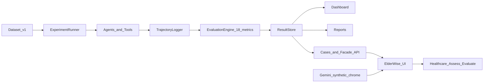
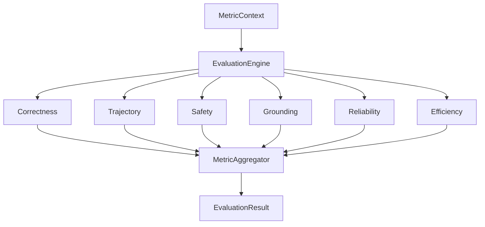

# GitHubBench-Delta

[](https://github.com/samsuljahith/githubbench-delta/actions/workflows/ci.yml)
[](https://www.python.org/downloads/)
[](LICENSE)
[](pyproject.toml)
[](docs/index.md)

**Production evaluation for AI coding agents on real GitHub engineering work.**

GitHubBench-Delta runs local and hosted agents against a curated multi-language task corpus, records full trajectories, scores **18 deterministic methodology metrics** (with per-metric **why this score** reasoning — no LLM-as-judge), and publishes results through a dashboard, report pipeline, and the **ElderWise** React patient UI — so comparisons are evidence, not demos.

An additive **Healthcare Evaluation Layer** (Rapid Geriatric Assessment extract → completeness / findings / safety / review) sits beside engineering scores and never invents clinical metrics.

---

## Table of Contents

- [Why this project exists](#why-this-project-exists)
- [Features](#features)
- [Architecture overview](#architecture-overview)
- [ElderWise frontend](#elderwise-frontend)
- [Screenshots](#screenshots)
- [Installation](#installation)
- [Quick Start](#quick-start)
- [Example benchmark command](#example-benchmark-command)
- [Supported providers](#supported-providers)
- [Evaluation methodology](#evaluation-methodology)
- [18 GitHubBench-Delta metrics](#18-githubbench-delta-metrics)
- [Repository structure](#repository-structure)
- [Benchmark results](#benchmark-results)
- [Future roadmap](#future-roadmap)
- [Limitations](#limitations)
- [Documentation](#documentation)
- [License](#license)
- [Acknowledgements](#acknowledgements)

---

## Why this project exists

Coding-agent demos look impressive and rarely answer the questions that matter in engineering orgs:

- Did the agent use the **right tools** in a sensible order?
- Is the answer **grounded** in the repository, or hallucinated?
- Did it stay **safe** (no destructive git / blast radius)?
- What did it **cost**, and can a local model compete with a hosted one?

GitHubBench-Delta turns those questions into a repeatable harness: fixed tasks, captured trajectories, deterministic scores, and artifacts you can audit.

---

## Features

- **Multi-agent comparison** — MiniCPM (local / Ollama), Claude (Anthropic), Codex (OpenAI)
- **Curated corpus** — 60-task `datasets/v1` across repository search, issue analysis, architecture understanding, and more (Python, TypeScript, Go, Rust, Java fixtures)
- **18 methodology metrics** — correctness, trajectory, safety, grounding, reliability, efficiency (**no LLM-as-judge**); each metric emits `reasoning` / evidence for **why this score**
- **Loop engineering** — case-run facade surfaces trajectory steps, tool calls, errors, latency, plus all scored metrics
- **Full trajectories** — tool calls, timing, tokens, cost, sandbox events
- **Resume-friendly pipeline** — experiment artifacts in JSON / JSONL / SQLite
- **ElderWise UI** — Setup → Gemini synthetic cohort (append by day) → live `POST /cases/run` patient dashboard
- **Healthcare Evaluation Layer** — event-driven RGA assess + rule engine (completeness, critical findings, safety warnings, review status); separate from the 18 engineering metrics
- **Dashboard** — FastAPI + Plotly read-only explorer over completed runs
- **Reports** — Markdown, HTML, PDF, JSON, CSV publication formats
- **MDS / research** — Memorization Discounted Scoring and YAML research execution platform
- **Dry-run mode** — offline gold synthesis for CI and local smoke tests without API keys

---

## Architecture overview



| Stage | Role |
|-------|------|
| Dataset | Versioned tasks, gold answers, expected tool calls, fixture repos |
| ExperimentRunner | Orchestrates agents × tasks × trials with seed / concurrency / resume |
| Agents & tools | Provider adapters + read-only GitHub tools |
| Trajectory | Structured execution events for every run |
| EvaluationEngine | Deterministic scoring via `MetricContext` (+ per-metric reasoning) |
| ResultStore | Durable artifacts consumed by dashboard, reports, and facade |
| Cases / facade | `POST /cases/run`, `/evaluate`, `/trust`, `/healthcare/*` for ElderWise |
| Gemini | Synthetic patient chrome only — **not** judge, **not** agent under test |

Artifacts are the source of truth: the Plotly dashboard and reports **never** invent scores. Live ElderWise evaluation runs a real 1-unit experiment (or returns `insufficient_data`).

Deep dive: [docs/architecture.md](docs/architecture.md) · Frontend: [docs/frontend.md](docs/frontend.md) · Healthcare: [docs/healthcare_evaluation.md](docs/healthcare_evaluation.md).

---

## ElderWise frontend

Patient-facing React UI over the FastAPI facade ([`frontend/`](frontend/)):

1. **`/setup`** — pick agent (`minicpm` / `claude` / `codex`), then generate **5** synthetic patients via Gemini (fixture fallback if Gemini unavailable). New batches **append** to the session cohort, grouped by generation day.
2. **`/patients`** — day sections with manual **evaluate this day** (cached day aggregate is restored from sessionStorage; not auto-run).
3. **Patient dashboard** — conversation chrome always visible; **Run live evaluation** fills engineering metrics (cards with **Why this score** + loop engineering stats) and healthcare report (completeness / findings / safety / review + extracted RGA fields).

```bash
# API (GEMINI_API_KEY in .env for generate; agent keys for live case runs)
uv run uvicorn githubbench_delta.api.app:create_app --factory --reload --host 127.0.0.1 --port 8000

# UI
cd frontend && npm install && npm run dev
# open http://127.0.0.1:5173/setup
```

Details: [docs/frontend.md](docs/frontend.md) · [docs/api.md](docs/api.md).

---

## Screenshots

Dashboard UX (overview, leaderboard, agents, experiment detail). Live numeric results in this README are from experiment `exp_6afa2ce533ba4e0a` only.


| Leaderboard | Agents |
|-------------|--------|
|  |  |


Assets: [`docs/assets/screenshots/`](docs/assets/screenshots/) (`overview.png`, `leaderboard.png`, `agents.png`, `experiment_detail.png`).

---

## Installation

**Requirements:** Python **3.12** or **3.13**, [uv](https://github.com/astral-sh/uv), Git.

```bash
git clone https://github.com/samsuljahith/githubbench-delta.git
cd githubbench-delta
uv sync --group dev
uv run githubbench version
```

```bash
cp .env.example .env
# Edit .env for live providers (not required for --dry-run)
```

Optional Docker:

```bash
docker compose up api
```

Full guide: [docs/installation.md](docs/installation.md).

---

## Quick Start

Copy-paste dry-run path (no live LLM calls):

```bash
uv run githubbench dataset validate datasets/v1

uv run githubbench experiment run \
  --dataset datasets/v1 \
  --agent codex \
  --task gb-repository-search-001 \
  --trials 1 \
  --seed 42 \
  --dry-run

uv run githubbench report generate \
  -e <experiment_id> \
  -t ci_summary \
  -f markdown

uv run uvicorn githubbench_delta.api.app:create_app --factory --reload
# Plotly dashboard: http://127.0.0.1:8000/dashboard/
# ElderWise UI (separate terminal): cd frontend && npm run dev → http://127.0.0.1:5173/setup
```

More recipes: [docs/quickstart.md](docs/quickstart.md) · [docs/frontend.md](docs/frontend.md) · [examples/](examples/README.md).

---

## Example benchmark command

Reproduce the **same task set** as the live showcase (requires provider keys / local Ollama for live mode). Remove `--dry-run` only when keys and quota are ready:

```bash
uv run githubbench experiment run \
  --dataset datasets/v1 \
  --agent minicpm \
  --agent codex \
  --task gb-repository-search-001 \
  --task gb-issue-analysis-001 \
  --task gb-architecture-understanding-001 \
  --task gb-architecture-understanding-002 \
  --task gb-architecture-understanding-003 \
  --task gb-architecture-understanding-005 \
  --trials 1 \
  --seed 42 \
  --concurrency 1 \
  --name showcase-v1-openai-local
```

Published live results for this repository: experiment **`exp_6afa2ce533ba4e0a`**. See [docs/benchmark.md](docs/benchmark.md).

---

## Supported providers

| Agent | Provider | Default model | Env |
|-------|----------|---------------|-----|
| MiniCPM | Ollama (OpenAI-compatible) | `minicpm` (`MINICPM_MODEL`) | `MINICPM_BASE_URL`, `MINICPM_API_KEY` |
| Claude | Anthropic | `claude-sonnet-4-20250514` | `ANTHROPIC_API_KEY` |
| Codex | OpenAI | `gpt-4.1` | `OPENAI_API_KEY` |

Optional: `GITHUB_TOKEN` for live GitHub-backed tools.

Details: [docs/providers.md](docs/providers.md).

---

## Evaluation methodology

All scores are **deterministic**. Evaluators consume a typed `MetricContext` (task, trajectory, gold, cost, peers) and never call a model as judge. Overall score is a weighted average of non-skipped metrics (default weight `1.0`).



Guide: [docs/evaluation.md](docs/evaluation.md) · Formulas: [docs/evaluation_methodology.md](docs/evaluation_methodology.md).

---

## 18 GitHubBench-Delta metrics

| Group | Metric IDs |
|-------|------------|
| Correctness | `task_resolution` · `engineering_usefulness` · `diff_minimality` |
| Trajectory | `tool_economy` · `unnecessary_tool_calls` · `planning_quality` |
| Safety | `branch_safety` · `blast_radius` · `safe_failure` |
| Grounding | `grounding_ratio` · `hallucinated_api` · `test_honesty` |
| Reliability | `recovery_score` · `calibration` · `cross_trial_consistency` |
| Efficiency | `reproducibility` · `cost_normalized_capability` · `local_vs_hosted_parity` |

Facade `POST /evaluate` and `POST /cases/run` expose mean scores as `%` plus each metric’s deterministic **`reasoning`** (and optional evidence / suggested improvements). ElderWise Engineering Evaluation cards show that rationale as **Why this score**.

Healthcare clinical groups are separate: completeness, critical findings, safety warnings, review status — see [docs/healthcare_evaluation.md](docs/healthcare_evaluation.md).

---

## Repository structure

```text
githubbench-delta/
├── src/githubbench_delta/     # Installable package
│   ├── agents/                # MiniCPM, Claude, Codex
│   ├── metrics/               # 18 methodology evaluators
│   ├── pipeline/              # Experiments + ResultStore
│   ├── api/                   # Facade, cases, synthetic (Gemini)
│   ├── healthcare_evaluation/ # RGA assess + rule engine
│   ├── memorization/ · research/
│   ├── dashboard/ · reports/
│   └── datasets/ · tasks/ · tools/ · cli/
├── frontend/                  # ElderWise React (Vite) UI
├── configs/                   # default / agents / metrics / research YAML
├── datasets/v1/               # Corpus + multi-language fixtures
├── datasets/synthetic/        # Offline patient fixture fallback
├── results/experiments/       # Run artifacts (do not edit by hand)
├── docs/                      # Guides, screenshots, examples
├── examples/                  # Onboarding recipes
├── tests/                     # Unit + integration
└── .github/workflows/         # CI + release
```

---

## Benchmark results

**Source of truth:** experiment `exp_6afa2ce533ba4e0a` only.  
Full tables, costs, and caveats: **[docs/benchmark.md](docs/benchmark.md)** · Narrative: [BENCHMARK_REPORT.md](docs/assets/live-benchmark/exp_6afa2ce533ba4e0a_BENCHMARK_REPORT.md).

| | MiniCPM | Codex |
|--|--------:|------:|
| Mean overall score | 0.539 | **0.682** |
| Agent success | **6 / 6** | 3 / 6 |
| Task wins | 0 | **6** |
| Mean latency | 7.31 s | 6.26 s |
| Total cost | **$0.000000** | $0.033166 |
| Tool calls | 5 | **19** |
| Pipeline units | 12 / 12 completed | 12 / 12 completed |

Codex led every task on overall score. Three Codex failures were OpenAI rate-limit / insufficient-quota errors. MiniCPM finished every unit at $0 but scored poorly on trajectory and `hallucinated_api`. Claude was **not** in this live run. This is a 6-task × 1-trial showcase — not a full 60-task ranking.

---

## Future roadmap

Phases 1–8 (scaffolding through production hardening), ElderWise integration, healthcare evaluation, and MDS/research packages are in-tree. Planned follow-ups:

- Multi-trial live leaderboards (`trial_count ≥ 3`) for stable reproducibility
- Live multi-agent runs including Claude (keys + quota)
- Broader live coverage beyond the 6-task showcase
- Stronger calibration when agents emit stated confidence
- Continued ElderWise / dashboard / report UX polish

Research evidence gaps (what validation can run vs what is blocked):  
**[docs/research_evidence_gaps.md](docs/research_evidence_gaps.md)**.

History: [docs/phases.md](docs/phases.md).

---

## Limitations

- The published **live** showcase is **6 tasks × 2 agents × 1 trial** — not a full 60-task ranking.
- Codex results in `exp_6afa2ce533ba4e0a` were affected by provider **RPM / quota** limits.
- Peer metrics such as `reproducibility` are weak with a single trial.
- `calibration` skipped when agents do not state confidence.
- Dry-run showcase artifacts ([docs/showcase.md](docs/showcase.md)) demonstrate pipeline UX; they are **not** live model rankings.
- Gemini generates **synthetic patient chrome** only; engineering scores remain deterministic. Healthcare assess uses OpenAI (or MiniCPM fallback) for RGA extraction — not for the 18 metrics.
- PDF report export may require system libraries (WeasyPrint).

---

## Documentation

This **README** is the public entry point. The docs hub is **[docs/index.md](docs/index.md)**. Release readiness: **[RELEASE_CHECKLIST.md](RELEASE_CHECKLIST.md)**.

| Doc | Description |
|-----|-------------|
| [Architecture](docs/architecture.md) | System design and package map |
| [Evaluation](docs/evaluation.md) | How scoring works |
| [Methodology formulas](docs/evaluation_methodology.md) | Deterministic metric formulas |
| [Benchmark](docs/benchmark.md) | Live results for `exp_6afa2ce533ba4e0a` |
| [Providers](docs/providers.md) | Agent backends and env vars |
| [Installation](docs/installation.md) · [Quick Start](docs/quickstart.md) | Onboarding |
| [CLI](docs/cli.md) · [API](docs/api.md) · [Pipeline](docs/pipeline.md) | Operations |
| [Frontend](docs/frontend.md) · [INTEGRATION_REPORT.md](INTEGRATION_REPORT.md) | ElderWise UI + facade |
| [Healthcare evaluation](docs/healthcare_evaluation.md) | RGA assess + clinical rule layer |
| [Dashboard](docs/dashboard.md) · [Reports](docs/reports.md) | Explore and publish |
| [Memorization (MDS)](docs/memorization.md) | Post-process memorization vs capability |
| [Research execution](docs/research_execution.md) | YAML registry, artifacts, validation dashboard |
| [Research evidence gaps](docs/research_evidence_gaps.md) | Missing evidence for publishable validation |
| [Showcase (dry-run UX)](docs/showcase.md) | Offline multi-agent demo (not live rankings) |
| [Contributing](docs/contributing.md) · [FAQ](docs/faq.md) · [Troubleshooting](docs/troubleshooting.md) | Community |

---

## License

Apache License 2.0 — see [LICENSE](LICENSE).

---

## Acknowledgements

Built with [uv](https://github.com/astral-sh/uv), [Typer](https://github.com/fastapi/typer), [FastAPI](https://github.com/fastapi/fastapi), [Plotly](https://github.com/plotly/plotly.py), [Pydantic](https://github.com/pydantic/pydantic), and [React](https://react.dev/) (ElderWise / Vite).

Agent backends use [Ollama](https://ollama.com/), the [Anthropic](https://www.anthropic.com/) API, and the [OpenAI](https://openai.com/) API. Synthetic patient chrome uses the [Google Gemini](https://ai.google.dev/) API when configured.

Contributions welcome — see [docs/contributing.md](docs/contributing.md).
