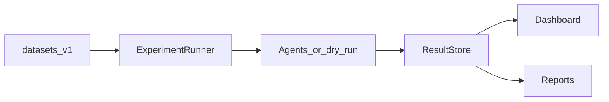

# Architecture

GitHubBench-Delta is a modular evaluation framework for comparing coding agents on GitHub engineering tasks.

## Data flow

```text
Dataset (tasks) → ExperimentRunner → Agent (or dry-run gold)
        → Trajectory + EvaluationEngine (18 metrics)
        → ResultStore artifacts (JSON / JSONL / SQLite)
        → Dashboard (explore) / Reports (publish)
```



## Package map

| Package | Responsibility |
|---------|----------------|
| `core` | Shared models, config, errors, retry |
| `agents` | Lifecycle `BaseAgent`, provider adapters, MiniCPM/Claude/Codex |
| `tools` | Pluggable `BaseTool`, registry, executor, read-only GitHub tools |
| `trajectory` | `ExecutionEvent` + `TrajectoryLogger` |
| `observability` | Run/trace/event IDs, contextvars, structured logging |
| `tasks` | Enriched `BaseTask`, task families, `TaskCatalog`, category registry |
| `datasets` | Loaders (JSON/JSONL/YAML), validators, manifests, `RepositoryRef` |
| `prompts` | Versioned prompt templates + content hashing |
| `benchmark` | `BenchmarkRunner` + deterministic sampling |
| `metrics` | 18 methodology evaluators under 6 groups + registry |
| `pipeline` | Experiment orchestration + ResultStore writers |
| `evals` | Eval run request/status models |
| `storage` | Path helpers + EventStore + ResultStore backends |
| `dashboard` | FastAPI + Plotly read-only explorer |
| `reports` | Publication reports (MD/HTML/PDF/JSON/CSV) |
| `api` | FastAPI app factory |
| `cli` | Typer entrypoint |

## Design principles

1. **Interfaces first** — agents, tasks, and metrics are pluggable ABCs.
2. **Config as source of truth** — YAML + env via pydantic-settings.
3. **Methodology metrics only** — no generic exact-match / semantic-similarity proxies.
4. **Artifacts as truth** — dashboard and reports read completed experiment outputs only.
5. **Typed everything** — Pydantic models and type hints throughout.

## Related docs

- [Evaluation methodology](evaluation_methodology.md)
- [Pipeline](pipeline.md)
- [Dashboard](dashboard.md)
- [Reports](reports.md)
- [Configuration](configuration.md)
