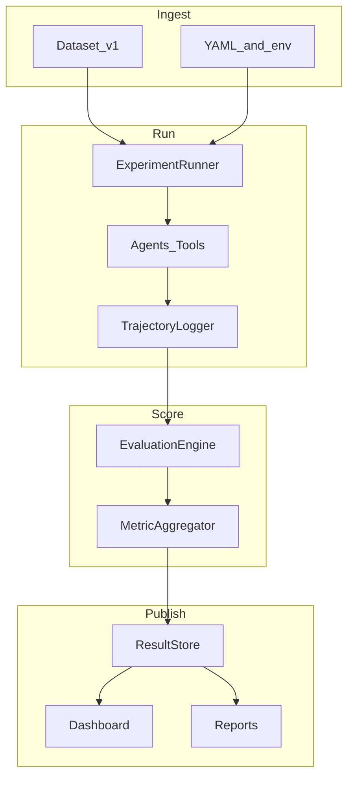

# Architecture

GitHubBench-Delta is a modular evaluation framework for comparing coding agents on GitHub engineering tasks. This document describes the **existing** system design — it does not propose architectural changes.

## Table of Contents

- [Data flow](#data-flow)
- [Component responsibilities](#component-responsibilities)
- [Package map](#package-map)
- [Design principles](#design-principles)
- [Artifact contract](#artifact-contract)
- [Related docs](#related-docs)

---

## Data flow

```text
Dataset (tasks)
    → ExperimentRunner
        → Agent (live provider) or dry-run gold synthesis
            → TrajectoryLogger (ExecutionEvent stream)
                → EvaluationEngine (18 deterministic metrics)
                    → ResultStore (JSON / JSONL / SQLite)
                        → Dashboard (explore) | Reports (publish)
```



**Key invariant:** dashboard and reports are read-only over completed experiment artifacts. They never call agents or re-score live.

---

## Component responsibilities

| Component | Responsibility |
|-----------|----------------|
| Dataset / tasks | Versioned prompts, gold answers, expected tools, fixture `RepositoryRef` |
| Agents | Lifecycle: initialize → prepare → plan → execute → validate → cleanup |
| Tools | Pluggable read-only GitHub tools via registry + executor |
| Trajectory | Ordered `ExecutionEvent` log with timing metadata |
| Metrics | 18 methodology evaluators under six groups |
| Pipeline | Experiment create/run/status, concurrency, resume, eval cache |
| Storage | EventStore + ResultStore backends |
| Dashboard | FastAPI + Plotly explorer |
| Reports | Jinja templates + export (MD / HTML / PDF / JSON / CSV) |
| CLI / API | Typer entrypoint and FastAPI app factory |

---

## Package map

| Package | Path under `src/githubbench_delta/` |
|---------|-------------------------------------|
| `core` | Shared models, config, errors, retry |
| `agents` | `BaseAgent`, provider adapters, MiniCPM / Claude / Codex |
| `tools` | `BaseTool`, registry, executor |
| `trajectory` | `ExecutionEvent`, `TrajectoryLogger` |
| `observability` | Run / trace IDs, structured logging |
| `tasks` | `BaseTask`, families, `TaskCatalog` |
| `datasets` | Loaders, validators, manifests |
| `prompts` | Versioned templates + hashing |
| `benchmark` | `BenchmarkRunner`, deterministic sampling |
| `metrics` | Evaluators, registry, engine, aggregator |
| `pipeline` | Experiment orchestration + writers |
| `evals` | Eval request / status models |
| `storage` | Path helpers, EventStore, ResultStore |
| `dashboard` | Read-only explorer |
| `reports` | Publication builders |
| `api` | FastAPI factory |
| `cli` | Typer CLI |

---

## Design principles

1. **Interfaces first** — agents, tasks, and metrics are pluggable ABCs.
2. **Config as source of truth** — YAML + env via pydantic-settings.
3. **Methodology metrics only** — no generic exact-match / semantic-similarity proxies as first-class scores.
4. **Artifacts as truth** — UI and reports consume completed outputs only.
5. **Typed everything** — Pydantic models and type hints throughout.

---

## Artifact contract

A completed experiment directory under `results/experiments/<experiment_id>/` typically includes:

| File | Purpose |
|------|---------|
| `experiment.json` | Experiment metadata, agents, tasks, status |
| `run.json` | Run progress, completed / failed units |
| `evaluation_results.json` | Per-unit scores and metric details |
| `trajectory.jsonl` | Per-unit trajectories and agent metrics |
| `completed_units.json` | Unit success flags |
| `eval_cache.jsonl` | Evaluation cache (when enabled) |

---

## Related docs

- [Evaluation](evaluation.md)
- [Benchmark results](benchmark.md)
- [Providers](providers.md)
- [Pipeline](pipeline.md)
- [Dashboard](dashboard.md)
- [Reports](reports.md)
- [Configuration](configuration.md)
- [Docs index](index.md)
