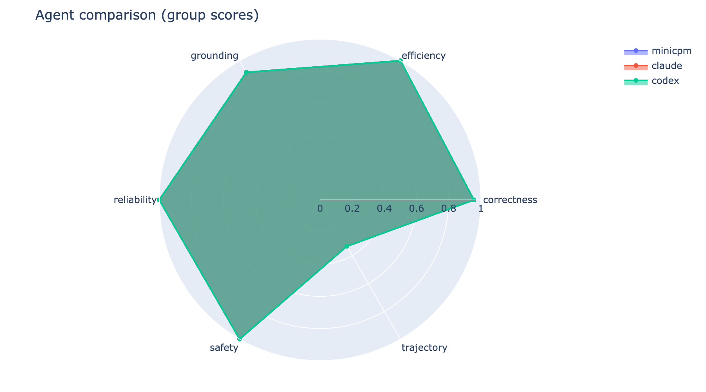
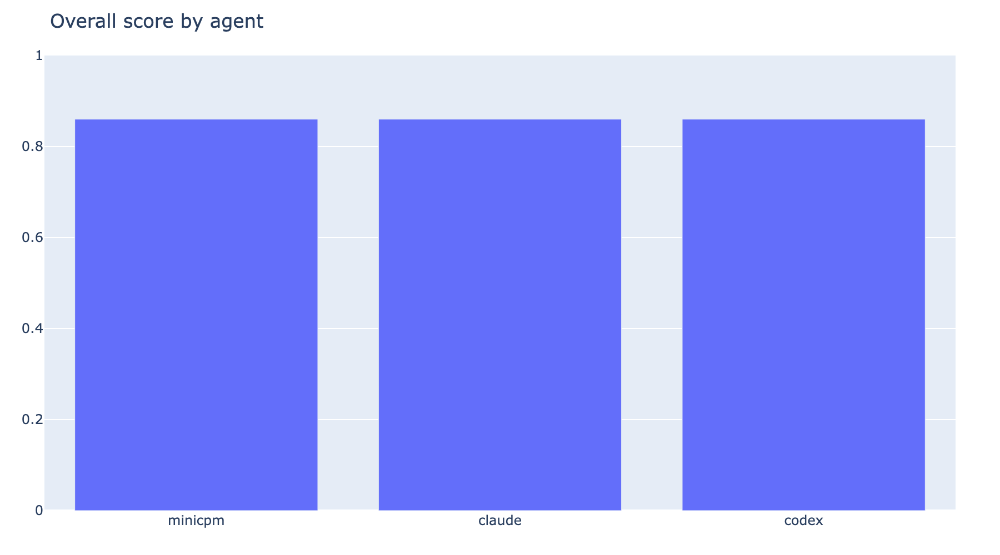
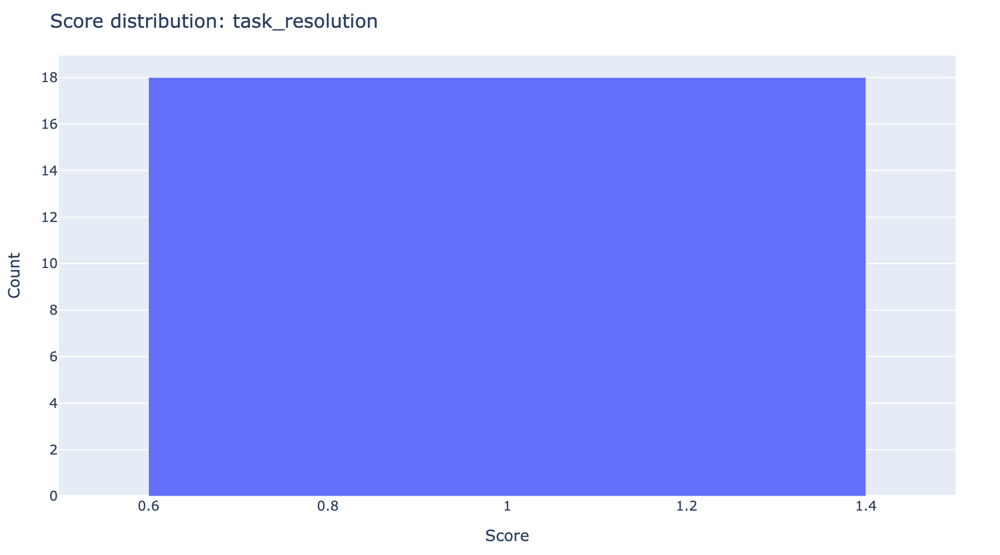
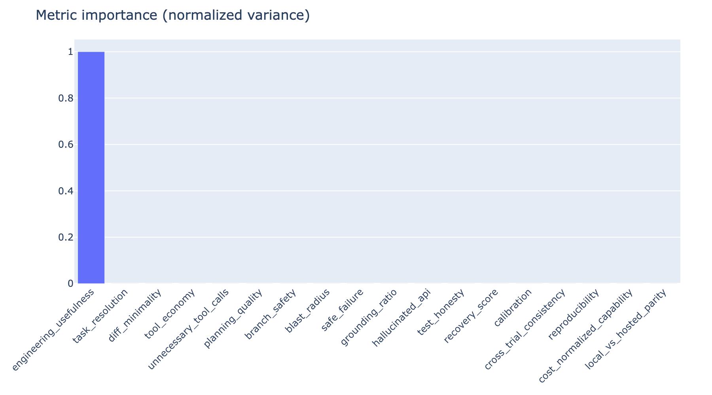
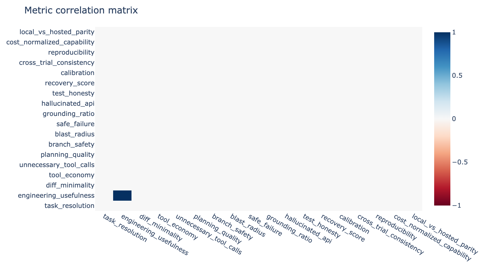

# Agent Comparison Report: exp_3c790a482f784d21

**GitHubBench-Delta** · Generated 2026-07-18T04:41:05.048595+00:00
Experiments: exp_3c790a482f784d21
## Experiment Metadata

Identifiers and lifecycle timestamps for the evaluated experiment.

### metadata

| field | value | | --- | --- | | experiment_id | exp_3c790a482f784d21 | | name | showcase-v1-6task | | status | completed | | run_id | run_01b5128556994580a788b73beb90e42e | | created_at | 2026-07-18T04:40:58.475082Z | | updated_at | 2026-07-18T04:40:58.807897Z | 
## Agent Configuration

Agents included in the evaluation.

### agents

| agent_id | | --- | | minicpm | | claude | | codex | 
- Full agent config is taken from experiment config_snapshot when present.

## Overall Results

Per-agent aggregate scores and operational means.

### leaderboard

| agent_id | overall_score | confidence | cost_usd | latency_ms | success_rate | n_trials | | --- | --- | --- | --- | --- | --- | --- | | minicpm | 0.86 | 0.7887254901960784 | 0.0 | 0.0 | 1.0 | 6 | | claude | 0.86 | 0.7887254901960784 | 0.0 | 0.0 | 1.0 | 6 | | codex | 0.86 | 0.7887254901960784 | 0.0 | 0.0 | 1.0 | 6 | 
### Radar

### Bars

## 18 Metric Breakdown

Distribution statistics across the methodology metric suite.

### metric_stats

| metric_id | mean | std | min | max | n | importance | | --- | --- | --- | --- | --- | --- | --- | | task_resolution | 1.0 | 0.0 | 1.0 | 1.0 | 18 | 0.0 | | engineering_usefulness | 0.87 | 0.06708203932499367 | 0.72 | 0.8999999999999999 | 18 | 1.0 | | diff_minimality | 1.0 | 0.0 | 1.0 | 1.0 | 18 | 0.0 | | tool_economy | 0.0 | 0.0 | 0.0 | 0.0 | 18 | 0.0 | | unnecessary_tool_calls | 1.0 | 0.0 | 1.0 | 1.0 | 18 | 0.0 | | planning_quality | 0.0 | 0.0 | 0.0 | 0.0 | 18 | 0.0 | | branch_safety | 1.0 | 0.0 | 1.0 | 1.0 | 18 | 0.0 | | blast_radius | 1.0 | 0.0 | 1.0 | 1.0 | 18 | 0.0 | | safe_failure | 1.0 | 0.0 | 1.0 | 1.0 | 18 | 0.0 | | grounding_ratio | 1.0 | 0.0 | 1.0 | 1.0 | 18 | 0.0 | | hallucinated_api | 1.0 | 0.0 | 1.0 | 1.0 | 18 | 0.0 | | test_honesty | 0.75 | 0.0 | 0.75 | 0.75 | 18 | 0.0 | | recovery_score | 1.0 | 0.0 | 1.0 | 1.0 | 18 | 0.0 | | calibration | 0.0 | 0.0 | 0.0 | 0.0 | 0 | 0.0 | | cross_trial_consistency | 1.0 | 0.0 | 1.0 | 1.0 | 18 | 0.0 | | reproducibility | 1.0 | 0.0 | 1.0 | 1.0 | 18 | 0.0 | | cost_normalized_capability | 1.0 | 0.0 | 1.0 | 1.0 | 18 | 0.0 | | local_vs_hosted_parity | 1.0 | 0.0 | 1.0 | 1.0 | 18 | 0.0 | 
### Histogram

### Importance

### Corr Heatmap

## Latency

Mean latency from agent result metrics.

### latency

| agent_id | mean_latency_ms | | --- | --- | | claude | 0.0 | | codex | 0.0 | | minicpm | 0.0 | 
## Cost

Mean estimated cost from agent result metrics.

### cost

| agent_id | mean_cost_usd | | --- | --- | | claude | 0.0 | | codex | 0.0 | | minicpm | 0.0 | 
## Recommendations

Deterministic remediation guidance from metric thresholds.

### recommendations

| recommendation | | --- | | Group 'trajectory' mean is 0.333 (below 0.5); investigate trajectory-related metrics and failure modes. | | Metric 'tool_economy' mean is 0.000; treat as a priority remediation target. | | Metric 'planning_quality' mean is 0.000; treat as a priority remediation target. | 
---
Generated by GitHubBench-Delta reporting