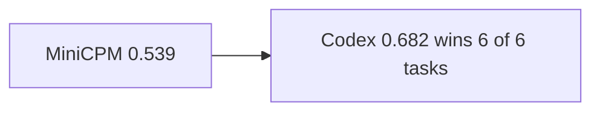

# Benchmark Results

Published **live** results for experiment **`exp_6afa2ce533ba4e0a`**.

All numbers in this document are taken only from experiment `exp_6afa2ce533ba4e0a`.

Published narrative report (tracked in-repo):  
[`assets/live-benchmark/exp_6afa2ce533ba4e0a_BENCHMARK_REPORT.md`](assets/live-benchmark/exp_6afa2ce533ba4e0a_BENCHMARK_REPORT.md)

No invented scores. Claude was **not** part of this run.

## Table of Contents

- [Experiment metadata](#experiment-metadata)
- [Executive summary](#executive-summary)
- [Agent comparison](#agent-comparison)
- [Task breakdown](#task-breakdown)
- [Cost summary](#cost-summary)
- [Reproduce the task set](#reproduce-the-task-set)
- [Caveats](#caveats)
- [Related docs](#related-docs)

---

## Experiment metadata

| Field | Value |
|-------|--------|
| Experiment ID | `exp_6afa2ce533ba4e0a` |
| Name | `showcase-v1-openai-local` |
| Status | completed |
| Dataset | `datasets/v1` |
| Seed | 42 |
| Trials | 1 |
| Agents | `minicpm`, `codex` |
| Mode | **Live** (not `--dry-run`) |
| Created | 2026-07-18T05:15:32Z |
| Updated | 2026-07-18T05:17:29Z |

### Tasks

1. `gb-repository-search-001` — Locate WidgetStore.add (Python)
2. `gb-issue-analysis-001` — Analyze blank name issue (Python)
3. `gb-architecture-understanding-001` — WidgetCLI layered design (Python)
4. `gb-architecture-understanding-002` — PulseBoard data flow (TypeScript)
5. `gb-architecture-understanding-003` — Inventory API package layout (Go)
6. `gb-architecture-understanding-005` — NotifyRS module boundaries (Rust)

---

## Executive summary

| Metric | Value |
|--------|------:|
| Total tasks | 6 |
| Total agents | 2 |
| Total run units | 12 |
| Successful agent runs | 9 |
| Failed agent runs | 3 |
| Overall agent completion rate | **75.0%** |
| Pipeline units completed | **12 / 12** |
| Pipeline failures | 0 |

**Headline:** Codex led on mean overall score (**0.682** vs **0.539**) and won every task head-to-head. MiniCPM completed every unit at **$0** but trailed on tool trajectory, planning, and `hallucinated_api`. Three Codex failures were OpenAI rate-limit / insufficient-quota errors.

---

## Agent comparison

### Summary table

| | MiniCPM | Codex |
|--|--------:|------:|
| Mean overall score | 0.539 | **0.682** |
| Agent success | **6 / 6** | 3 / 6 |
| Task wins | 0 | **6** |
| Mean latency | 7.31 s | 6.26 s |
| Total cost | **$0.000000** | $0.033166 |
| Tool calls (total) | 5 | **19** |
| Avg tokens / run | 1,240 | 2,183 |

### Group scores (means)

| Group | MiniCPM | Codex |
|-------|--------:|------:|
| Correctness | 0.669 | 0.594 |
| Trajectory | 0.056 | 0.575 |
| Safety | 1.000 | 0.983 |
| Grounding | 0.583 | 0.750 |
| Reliability | 0.583 | 1.000 |
| Efficiency | 0.357 | 0.296 |



---

## Task breakdown

| Task | Winner | MiniCPM score | Codex score | MiniCPM latency | Codex latency | MiniCPM cost | Codex cost |
|------|--------|--------------:|------------:|----------------:|--------------:|-------------:|-----------:|
| Locate WidgetStore.add | Codex | 0.521 | **0.836** | 8.11 s | 4.29 s | $0.000 | $0.004 |
| Analyze blank name issue | Codex | 0.501 | **0.568** | 3.69 s | 2.20 s | $0.000 | $0.002 |
| WidgetCLI layered design | Codex | 0.497 | **0.568** | 4.78 s | 0.00 s* | $0.000 | $0.000 |
| PulseBoard data flow | Codex | 0.508 | **0.577** | 14.87 s | 6.42 s | $0.000 | $0.010 |
| Inventory API package layout | Codex | 0.544 | **0.748** | 1.47 s | 14.91 s | $0.000 | $0.010 |
| NotifyRS module boundaries | Codex | 0.662 | **0.795** | 10.91 s | 9.74 s | $0.000 | $0.006 |

\*Codex aborted early on WidgetCLI (rate limit); latency recorded as 0.00 s.

| Task | MiniCPM success | Codex success | MiniCPM tools | Codex tools |
|------|:---------------:|:-------------:|--------------:|------------:|
| Locate WidgetStore.add | Yes | Yes | 1 | 2 |
| Analyze blank name issue | Yes | No | 1 | 2 |
| WidgetCLI layered design | Yes | No | 1 | 0 |
| PulseBoard data flow | Yes | No | 1 | 6 |
| Inventory API package layout | Yes | Yes | 1 | 5 |
| NotifyRS module boundaries | Yes | Yes | 0 | 4 |

---

## Cost summary

| Agent | Total cost |
|-------|----------:|
| MiniCPM | $0.000000 |
| Codex | $0.033166 |
| **Benchmark total** | **$0.033166** |

---

## Reproduce the task set

Copy-paste (live mode — requires keys / Ollama and adequate OpenAI quota):

```bash
uv run githubbench experiment run \
  --dataset datasets/v1 \
  --agent minicpm \
  --agent codex \
  --task gb-repository-search-001 \
  --task gb-issue-analysis-001 \
  --task gb-architecture-understanding-001 \
  --task gb-architecture-understanding-002 \
  --task gb-architecture-understanding-003 \
  --task gb-architecture-understanding-005 \
  --trials 1 \
  --seed 42 \
  --concurrency 1 \
  --name showcase-v1-openai-local
```

Offline pipeline demo (not comparable to live scores):

```bash
uv run githubbench experiment run \
  --dataset datasets/v1 \
  --agent minicpm \
  --agent claude \
  --agent codex \
  --task gb-repository-search-001 \
  --task gb-issue-analysis-001 \
  --task gb-architecture-understanding-001 \
  --task gb-architecture-understanding-002 \
  --task gb-architecture-understanding-003 \
  --task gb-architecture-understanding-005 \
  --trials 1 \
  --seed 42 \
  --concurrency 1 \
  --name showcase-v1-6task \
  --dry-run
```

---

## Caveats

- Six-task showcase only — not a full 60-task production ranking.
- Single trial (`trial_count=1`); `reproducibility` is uninformative across dissimilar agent peers.
- Three Codex units failed on provider rate-limit / quota, not necessarily task inability.
- `calibration` was skipped when outputs lacked stated confidence.
- Dry-run showcase (`exp_3c790a482f784d21`) is a separate UX demo — see [showcase.md](showcase.md).

---

## Related docs

- Full narrative report: [exp_6afa2ce533ba4e0a_BENCHMARK_REPORT.md](assets/live-benchmark/exp_6afa2ce533ba4e0a_BENCHMARK_REPORT.md)
- [Evaluation](evaluation.md)
- [Providers](providers.md)
- [Showcase (dry-run)](showcase.md)
- [Docs index](index.md)
