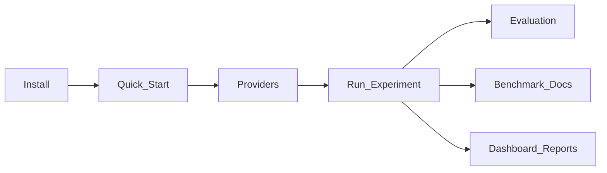
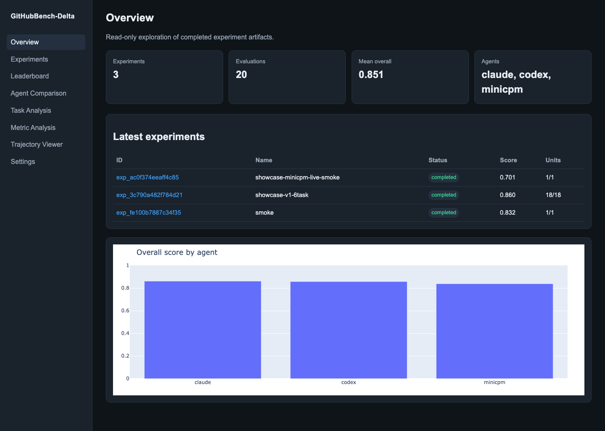

# Documentation

Welcome to **GitHubBench-Delta** — a production evaluation framework for comparing AI coding agents on GitHub engineering tasks.

**Public entry point:** always start from the repository [README.md](../README.md). This index organizes deeper guides.

## Start here

| Path | Audience |
|------|----------|
| [../README.md](../README.md) | **Entry point** — overview, badges, benchmark summary |
| [installation.md](installation.md) | Install with uv / pip / Docker |
| [quickstart.md](quickstart.md) | First dry-run experiment in minutes |
| [benchmark.md](benchmark.md) | Live results for `exp_6afa2ce533ba4e0a` only |
| [../RELEASE_CHECKLIST.md](../RELEASE_CHECKLIST.md) | Release readiness checklist |



---

## Core guides

| Document | Description |
|----------|-------------|
| [architecture.md](architecture.md) | System data flow, packages, artifact contract |
| [evaluation.md](evaluation.md) | How the 18 metrics are scored |
| [evaluation_methodology.md](evaluation_methodology.md) | Deterministic formulas (reference) |
| [benchmark.md](benchmark.md) | Live showcase numbers (`exp_6afa2ce533ba4e0a` only) |
| [providers.md](providers.md) | MiniCPM, Claude, Codex setup |
| [pipeline.md](pipeline.md) | Experiment orchestration |
| [memorization.md](memorization.md) | Memorization Discounted Scoring (post-process) |
| [research_execution.md](research_execution.md) | Research execution / reproducibility platform |
| [research_evidence_gaps.md](research_evidence_gaps.md) | Missing evidence for publishable research claims |
| [configuration.md](configuration.md) | YAML + env configuration |

---

## Operate

| Document | Description |
|----------|-------------|
| [cli.md](cli.md) | Typer CLI reference |
| [api.md](api.md) | FastAPI endpoints |
| [frontend.md](frontend.md) | ElderWise React UI + facade integration |
| [dashboard.md](dashboard.md) | Interactive explorer |
| [reports.md](reports.md) | MD / HTML / PDF / JSON / CSV |
| [memorization.md](memorization.md) | MDS CLI + twin sidecars + dashboard |
| [research_execution.md](research_execution.md) | Research registry, artifacts, validation dashboard |
| [plugins.md](plugins.md) | Extension points |
| [troubleshooting.md](troubleshooting.md) | Common failures |
| [faq.md](faq.md) | Short answers |

---

## Showcase & assets

| Document / path | Description |
|-----------------|-------------|
| [showcase.md](showcase.md) | Dry-run multi-agent UX demo (`exp_3c790a482f784d21`) |
| [assets/screenshots/](assets/screenshots/) | Dashboard PNGs (`overview`, `leaderboard`, `agents`, `experiment_detail`) |
| [assets/example-report/](assets/example-report/) | Example HTML / MD reports |
| [assets/example-benchmark/](assets/example-benchmark/) | Example leaderboard CSV |
| [assets/memorization/](assets/memorization/) | Sample MDS report (partly synthetic) |

### Screenshots



Live scored showcase (authoritative numbers):  
[`assets/live-benchmark/exp_6afa2ce533ba4e0a_BENCHMARK_REPORT.md`](assets/live-benchmark/exp_6afa2ce533ba4e0a_BENCHMARK_REPORT.md)

---

## Contribute & release

| Document | Description |
|----------|-------------|
| [contributing.md](contributing.md) | How to contribute |
| [phases.md](phases.md) | Completed development phases |
| [release.md](release.md) | Release process |
| [engineering_audit.md](engineering_audit.md) | Engineering audit notes |
| [research_execution.md](research_execution.md) | Research execution platform (YAML registry + exporters) |
| [research_evidence_gaps.md](research_evidence_gaps.md) | Publishability evidence gaps (MDS / Trust / Observatory) |

---

## Copy-paste onboarding

```bash
git clone https://github.com/samsuljahith/githubbench-delta.git
cd githubbench-delta
uv sync --group dev
cp .env.example .env

uv run githubbench dataset validate datasets/v1
uv run githubbench experiment run \
  --dataset datasets/v1 \
  --agent codex \
  --task gb-repository-search-001 \
  --trials 1 \
  --seed 42 \
  --dry-run

uv run uvicorn githubbench_delta.api.app:create_app --factory --reload
```

Then open http://127.0.0.1:8000/dashboard/

---

## License

Apache-2.0 — see [../LICENSE](../LICENSE).
