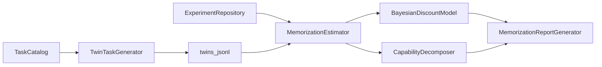

# Memorization Discounted Scoring (MDS)

Optional **post-processing** analysis that estimates how much of an observed benchmark score may be attributable to **memorization lift** versus **generalization capability**.

MDS does **not** add a metric to the registry and does **not** modify experiment artifacts. It reads completed evaluations (and optional twin-task sidecars) after the fact.

## Decomposition

\[
S_{\mathrm{obs}} = G + L
\]

| Symbol | Meaning |
|--------|---------|
| \(S_{\mathrm{obs}}\) | Mean overall score on the parent task |
| \(S_{\mathrm{twin}}\) | Mean overall score on a paraphrase twin (when evaluated) |
| \(L\) | Memorization lift \(=\max(0,\ S_{\mathrm{obs}}-S_{\mathrm{twin}})\) |
| \(G\) | Generalization capability \(=S_{\mathrm{obs}}-L\) |
| \(S_{\mathrm{disc}}\) | Discounted score \(=S_{\mathrm{obs}}-\hat{L}\) using the posterior mean of \(L\) |

## Methodology

1. **TwinTaskGenerator** builds deterministic paraphrase twins from parent tasks (synonym + clause-reorder transforms; **no LLM**). Twins are written to a **sidecar** JSONL under `results/memorization/twins/` — the `datasets/v1` corpus is never mutated.
2. **TwinValidator** checks parent linkage, gold/repo stability, and distinct prompts.
3. **MemorizationEstimator** joins parent/twin evaluation rows when twin `task_id`s appear in experiments; otherwise **proxy mode** estimates \(L\) from \(0.5\times(1-\mathrm{mean}(\mathrm{reproducibility},\mathrm{cross\_trial\_consistency},\mathrm{grounding\_ratio}))\).
4. **BayesianDiscountModel** updates a Beta(1,1) prior with fractional lift samples and reports a 95% credible interval (Normal approximation on the Beta mean; no scipy).
5. **CapabilityDecomposer** + **MemorizationReportGenerator** emit JSON / Markdown / Plotly dashboard.



## CLI

```bash
# Emit twin specs (does not run agents)
uv run githubbench memorization generate-twins --dataset datasets/v1 \
  -o results/memorization/twins/twins.jsonl

# Analyze completed experiments (proxy mode if twins were not evaluated)
uv run githubbench memorization analyze -e exp_6afa2ce533ba4e0a \
  --twins-path results/memorization/twins/twins.jsonl \
  -o results/memorization/reports/latest

uv run githubbench memorization report -e exp_6afa2ce533ba4e0a
uv run githubbench memorization export -e exp_6afa2ce533ba4e0a -f json,markdown,html
```

### Outputs

| File | Contents |
|------|----------|
| `memorization_report.json` | Lifts, breakdowns, posteriors, mode |
| `capability_breakdown.md` | Narrative tables + assumptions |
| `memorization_dashboard.html` | Interactive Plotly dashboard |
| `charts/*.html` | Capability vs L, twin agreement, lift hist, posterior CIs |

## Assumptions

- Twin paraphrases preserve the same underlying engineering ask (same gold / repo / tools).
- Positive parent−twin gaps are attributed to memorization lift (correlational, not causal).
- Proxy mode is intentionally conservative (×0.5) and low-confidence.
- Equal treatment of agents; no provider-specific priors beyond the data.

## Limitations

- Without twin **evaluations**, MDS cannot observe true paraphrase gaps.
- Deterministic paraphrases may remain lexically close to parents.
- Beta lift model is a conjugate convenience, not a hierarchical cognitive model.
- Single-trial experiments weaken proxy consistency signals.
- MDS scores must not replace capability leaderboards.

## Future validation experiments

See the full evidence-gap audit: **[research_evidence_gaps.md](research_evidence_gaps.md)** (what can run today vs what is blocked for publishable claims).

1. Run agents on twin sidecars and compare proxy \(\hat{L}\) vs twin \(\hat{L}\).
2. Adversarial twins that change surface form but keep golds; measure lift stability.
3. Contaminated-prompt audits (web search for task phrasing) as an external prior on \(L\).
4. Hierarchical Bayesian pooling across task categories.
5. Human labels of “memorized vs reasoned” trajectories for calibration.

## Demo assets

[`docs/assets/memorization/`](assets/memorization/) contains a sample report seeded from live showcase means (MiniCPM 0.539, Codex 0.682) with **synthetic** twin gaps for charts.

## Related

- [Implementation report](../IMPLEMENTATION_REPORT.md)
- [Evaluation](evaluation.md) · [CLI](cli.md) · [Benchmark](benchmark.md)
