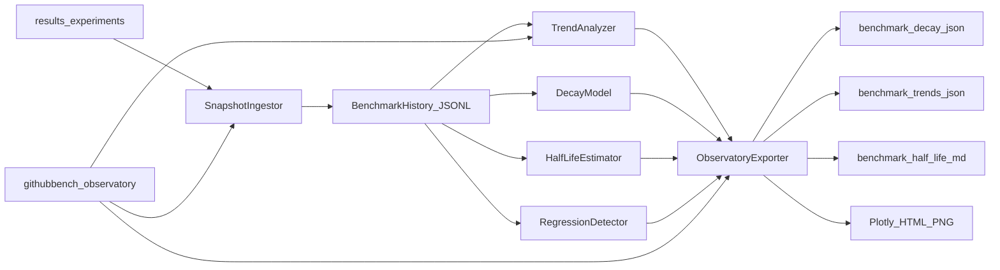

# Half-Life Observatory

Longitudinal analysis of how quickly a benchmark loses **differentiation** between models — the “half-life” of useful ranking power.

This package is **additive**. It does not change evaluators, ResultStore schemas, or `experiment.json` / `evaluation_results.json` shapes. History lives under `results/observatory/` (gitignored runtime data). Demo fixtures are under [`docs/assets/observatory/`](assets/observatory/).

## Motivation

As models improve, mean scores rise toward the ceiling (**saturation**) and the spread between models shrinks (**differentiation decay**). When differentiation halves, the benchmark’s ability to separate agents has a measurable **half-life**.

## Architecture



| Module | Role |
|--------|------|
| `models` | `BenchmarkSnapshot`, `HalfLifeEstimate`, `TrendReport`, … |
| `history` | Idempotent JSONL store (`history.jsonl` + `index.json`) |
| `ingest` | Build snapshots from completed experiments |
| `decay` | Log-linear fit of \(D(t) \approx D_0 e^{-\lambda t}\) |
| `half_life` | Half-life, confidence, usefulness trend |
| `trends` | Score / provider / model / saturation series |
| `regression` | Sudden differentiation drops / saturation spikes |
| `charts` | Plotly HTML (+ PNG when Kaleido is available) |
| `export` | Report bundle writer |
| `cli` | `githubbench observatory …` |

## Snapshot model

One snapshot per `(experiment_id, agent_id)`:

- `timestamp`, `benchmark_version` (package version + dataset leaf name)
- `model`, `provider`, `score` (mean overall), latency / cost / tool usage
- `task_count`, `success_rate`, `metric_summary`
- `source` — path reference to the experiment directory (not a full artifact copy)

`BenchmarkHistory.append` is idempotent on `experiment_id::agent_id`.

## Mathematics

Per cohort timestamp \(t\) (snapshots sharing the same experiment timestamp):

1. **Differentiation** \(D(t)\) = population stddev of model scores (max−min when \(n=2\))
2. **Saturation** \(S(t)\) = mean score (ceiling 1.0)
3. Fit \(D(t) \approx D_0 e^{-\lambda t}\) via log-linear least squares (numpy / `np.polyfit`)
4. **Half-life** \(t_{1/2} = \ln 2 / \lambda\) when \(\lambda > 0\); otherwise undefined / non-decaying
5. **Confidence** blends fit \(R^2\), cohort count, time span, and multi-model presence (clamped to \([0,1]\))

Minimum reliable history: **≥3** distinct timestamps with **≥2** models. Fewer points still produce saturation-only output with a confidence penalty.

## CLI

```bash
# Primary path: ingest completed experiments
uv run githubbench observatory ingest
uv run githubbench observatory ingest -e exp_6afa2ce533ba4e0a

# Analyze / report / export
uv run githubbench observatory analyze -o results/observatory/reports/latest
uv run githubbench observatory report --history-dir results/observatory
uv run githubbench observatory trend --provider
uv run githubbench observatory export -f json,markdown,html -o ./obs-out

# Optional: append a snapshot after a successful experiment run
uv run githubbench experiment run --dataset datasets/v1 --agent minicpm --record-observatory
```

### Outputs

Default output directory: `results/observatory/reports/<UTC timestamp>/`

| File | Contents |
|------|----------|
| `benchmark_decay.json` | λ, half-life, curve points, saturation, confidence, regressions |
| `benchmark_trends.json` | Score / provider / model / saturation series |
| `benchmark_half_life.md` | Narrative summary + tables + assumptions |
| `charts/*.html` | Plotly figures (PNG when Kaleido is installed) |

## Demo assets

[`docs/assets/observatory/`](assets/observatory/) contains a **labeled** synthetic history: five synthetic cohorts plus one cohort using live mean scores from `exp_6afa2ce533ba4e0a` (MiniCPM 0.539, Codex 0.682). See that folder’s README — synthetic points are not real rankings.

Reproduce analysis from the demo history:

```bash
uv run githubbench observatory analyze \
  --history-dir docs/assets/observatory \
  -o /tmp/observatory-demo
```

## Non-goals (v1)

- No changes to `CorpusQualityValidator`, metrics engine, or ResultStore writers
- No LLM-as-judge
- No dashboard UI pages (CLI + files + docs only)

## Related

- [Implementation report](../IMPLEMENTATION_REPORT.md) — design decisions and limitations
- [CLI reference](cli.md) · [Benchmark results](benchmark.md) · [Architecture](architecture.md)
