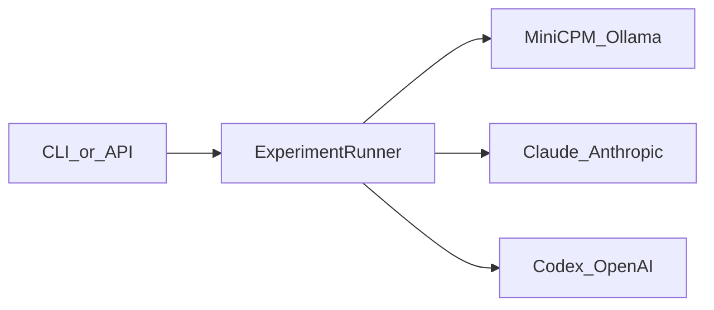

# Providers

GitHubBench-Delta ships three first-class agents. Configuration lives in [`configs/agents.yaml`](../configs/agents.yaml); secrets and overrides in [`.env.example`](../.env.example).

## Table of Contents

- [Overview](#overview)
- [MiniCPM local](#minicpm-local)
- [Claude Anthropic](#claude-anthropic)
- [Codex OpenAI](#codex-openai)
- [Environment setup](#environment-setup)
- [Dry-run vs live](#dry-run-vs-live)
- [Verify agents](#verify-agents)
- [Related docs](#related-docs)

---

## Overview

| Agent ID | Display name | Provider | Default model | Cost defaults (per 1k tokens) |
|----------|--------------|----------|---------------|-------------------------------|
| `minicpm` | MiniCPM (Local) | Ollama OpenAI-compatible | `minicpm` | $0.00 / $0.00 |
| `claude` | Claude | Anthropic | `claude-sonnet-4-20250514` | $0.003 / $0.015 |
| `codex` | Codex | OpenAI | `gpt-4.1` | $0.002 / $0.008 |



---

## MiniCPM (local)

- **Base URL:** `http://localhost:11434/v1` (override with `MINICPM_BASE_URL`)
- **API key env:** `MINICPM_API_KEY` (Ollama often accepts any non-empty value, e.g. `ollama`)
- **Model:** `MINICPM_MODEL` (showcase environments sometimes use a pulled tag such as `llama3.2:1b`)

Requires a running Ollama (or compatible) server for **live** runs.

---

## Claude (Anthropic)

- **API key env:** `ANTHROPIC_API_KEY`
- **Base URL:** `https://api.anthropic.com`
- **Model:** `claude-sonnet-4-20250514` (from `configs/agents.yaml`)

---

## Codex (OpenAI)

- **API key env:** `OPENAI_API_KEY`
- **Base URL:** `https://api.openai.com/v1`
- **Model:** `gpt-4.1` (from `configs/agents.yaml`)

Live multi-task runs need sufficient **RPM and quota**. Experiment `exp_6afa2ce533ba4e0a` recorded three Codex failures from rate-limit / insufficient-quota errors — see [benchmark.md](benchmark.md).

---

## Environment setup

```bash
cp .env.example .env
```

Relevant variables:

```bash
# Anthropic (Claude)
ANTHROPIC_API_KEY=

# OpenAI (Codex)
OPENAI_API_KEY=

# MiniCPM via local Ollama (OpenAI-compatible)
MINICPM_BASE_URL=http://localhost:11434/v1
MINICPM_API_KEY=ollama
MINICPM_MODEL=minicpm

# Optional for live GitHub tools
GITHUB_TOKEN=
```

Never commit `.env`.

---

## Dry-run vs live

| Mode | Flag | Provider keys | Use case |
|------|------|---------------|----------|
| Dry-run | `--dry-run` | Not required | CI, local smoke, pipeline UX demos |
| Live | *(omit flag)* | Required for selected agents | Real model comparison |

Dry-run synthesizes gold-based answers for offline reproducibility. Do **not** treat dry-run scores as live model rankings ([showcase.md](showcase.md)).

---

## Verify agents

```bash
uv run githubbench list agents
uv run githubbench config show
```

Smoke a single dry-run unit:

```bash
uv run githubbench experiment run \
  --dataset datasets/v1 \
  --agent minicpm \
  --task gb-repository-search-001 \
  --trials 1 \
  --seed 42 \
  --dry-run
```

---

## Related docs

- [Installation](installation.md)
- [Benchmark results](benchmark.md)
- [Configuration](configuration.md)
- [Docs index](index.md)
