# Research Validation — Missing Evidence Audit

**Scope:** Empirical evidence required for *publishable* research claims from GitHubBench-Delta’s research layers (MDS, TrustScore, Half-Life Observatory), assuming the **software infrastructure already exists**.

**Out of scope:** Feature requests, code changes, or implementation suggestions.

**Live evidence snapshot (as of this audit):**

| Artifact | Role |
|----------|------|
| `exp_6afa2ce533ba4e0a` | Live MiniCPM vs Codex, **6 tasks**, `trial_count=1` |
| `exp_3c790a482f784d21` | Dry-run UX showcase only (not capability evidence) |
| `datasets/v1` | 60 curated tasks + golds; **no twins in corpus** |
| MDS sample report | Demo with **synthetic** twin gaps |
| Observatory demo history | Mostly **synthetic** cohorts + one live score cohort |

---

## 1. MDS evidence gaps

Validation items from [`docs/memorization.md`](memorization.md) § Future validation experiments.

### E1 — Twin evaluation campaign (proxy \(\hat L\) vs twin \(\hat L\))

| Gap type | Missing evidence |
|----------|------------------|
| Missing datasets | Scored twin task instances (sidecar specs ≠ evaluated twins) |
| Missing benchmark runs | Same agents on `{parent}__twin_para_*` paired with parents; ideally stratified or full v1 |
| Missing human annotations | Not required for E1 itself; needed for E5 calibration |
| Missing baselines | Published paraphrase / memorization protocols for effect-size comparison |
| Missing statistical assumptions | Paired design (seed/agent/fixture); enough pairs for CI on \(\Delta L\); paraphrase independent of gold leakage |

**Blocker:** no twin evaluation rows in any live experiment.

### E2 — Adversarial twins (surface form changes; golds fixed)

| Gap type | Missing evidence |
|----------|------------------|
| Missing datasets | Adversarial twin catalog (distractors, entity rename, clause stress) beyond synonym reorder |
| Missing benchmark runs | Parent vs adversarial-twin paired evaluations |
| Missing human annotations | Expert intent-preservation / gold-validity checks |
| Missing baselines | Prior adversarial-paraphrase robustness suites for coding agents |
| Missing statistical assumptions | Intent-preservation criterion; lift stability across twin kinds |

**Blocker:** no adversarial twin dataset and no paired runs.

### E3 — Contaminated-prompt audits (external prior on \(L\))

| Gap type | Missing evidence |
|----------|------------------|
| Missing datasets | Per-task web/GitHub/training-proxy overlap reports for `datasets/v1` |
| Missing benchmark runs | Optional post-sanitization re-evals (absent) |
| Missing human annotations | Manual true-positive confirmation of contamination hits |
| Missing baselines | Established contamination-audit protocols and published rates |
| Missing statistical assumptions | Map contamination score → prior on \(L\); false-positive model |

**Blocker:** no contamination audit dataset for v1.

### E5 — Human labels: memorized vs reasoned trajectories

| Gap type | Missing evidence |
|----------|------------------|
| Missing datasets | Labeled trajectory corpus |
| Missing benchmark runs | Showcase trajectories exist; **labels** do not |
| Missing human annotations | Multi-rater memorized/reasoned labels + inter-rater agreement |
| Missing baselines | Rubrics / protocols for agent trajectory judgment |
| Missing statistical assumptions | Label reliability (κ); mapping labels → calibration of \(\hat L\) |

**Blocker:** zero human memorization/reasoning annotations beyond task golds.

### MDS summary

| Experiment | Runnable now? | Publishable primary claim? |
|------------|---------------|----------------------------|
| E0b Proxy-mode MDS on live rows | Yes | No (proxy unvalidated) |
| E1 Twin vs proxy \(\hat L\) | No | Blocked on twin runs |
| E2 Adversarial twins | No | Blocked on dataset + runs + expert checks |
| E3 Contamination prior | No | Blocked on audit dataset |
| E4 Hierarchical pooling (shared with scale) | No | Blocked on coverage + multi-trial / twins |
| E5 Human calibration | No | Blocked on annotations |

---

## 2. Scale evidence gaps

From [`RELEASE_CHECKLIST.md`](../RELEASE_CHECKLIST.md), live benchmark ask, and MDS hierarchical pooling.

### E6 — Multi-trial live leaderboard (`trial_count≥3`) + peer metrics

| Gap type | Missing evidence |
|----------|------------------|
| Missing datasets | None (v1 exists) |
| Missing benchmark runs | Live multi-trial MiniCPM / Codex / Claude on ≥ showcase (ideally 60 tasks) |
| Missing human annotations | Optional agent stated-confidence for calibration |
| Missing baselines | External coding-agent leaderboards under matched protocol |
| Missing statistical assumptions | Trial i.i.d. under seed policy; power analysis; rate-limit failures as MNAR |

**Blocker:** all documented live/showcase experiments use `trial_count=1`.

### E7 — Full-corpus live multi-agent ranking (60 tasks × ≥3 agents)

| Gap type | Missing evidence |
|----------|------------------|
| Missing datasets | None |
| Missing benchmark runs | Full 60-task live runs including Claude with adequate quota; multi-trial preferred |
| Missing human annotations | Spot-check of failure modes (expected for a paper) |
| Missing baselines | External benchmark comparison tables |
| Missing statistical assumptions | Multiple-comparison correction; cost/latency covariates |

**Blocker:** live evidence is 6 tasks × 2 agents only.

### E0a — Live showcase ranking (already runnable, limited claim)

| Gap type | Missing for publishability |
|----------|----------------------------|
| Missing datasets | Broader than 6-task slice |
| Missing benchmark runs | `trial_count≥3`; Claude live |
| Missing baselines | External suites |
| Missing statistical assumptions | Peer metrics underdetermined at \(n=1\) |

### Scale summary

| Experiment | Runnable now? | Publishable primary claim? |
|------------|---------------|----------------------------|
| E0a 6-task live ranking | Yes | No (underpowered / narrow) |
| E6 Multi-trial leaderboard | No | Blocked on multi-trial runs |
| E7 Full 60-task ranking | No | Blocked on full live coverage |
| E4 Hierarchical Bayes | No | Blocked on category-balanced outcomes |

---

## 3. Observatory + TrustScore evidence gaps

### E9 — Observatory half-life on **real** longitudinal history

| Gap type | Missing evidence |
|----------|------------------|
| Missing datasets | Versioned corpus snapshots over time *or* frozen corpus + changing model frontier |
| Missing benchmark runs | ≥3 distinct **real** timestamps with ≥2 models on a comparable task set |
| Missing human annotations | Optional “useful differentiation” judgments |
| Missing baselines | Published benchmark-aging / saturation studies |
| Missing statistical assumptions | Exponential \(D(t)\) decay; cohort comparability; aligned clocks |

**Blocker:** only one live cohort is real; demo multi-cohort history is mostly synthetic.

### E0d — Observatory demo fit (already runnable as software demo)

| Gap type | Missing for publishability |
|----------|----------------------------|
| Missing benchmark runs | Real multi-run series (synthetic cohorts do not count) |
| Missing statistical assumptions | Half-life unidentified from a single real timestamp |

### E8 — TrustScore weight learning / Bayesian resampling validation

| Gap type | Missing evidence |
|----------|------------------|
| Missing datasets | Held-out reliability targets (human trust ratings or re-run outcomes) |
| Missing benchmark runs | Multi-trial / multi-run archives for resampling |
| Missing human annotations | Expert/stakeholder “how trustworthy is this eval?” ratings |
| Missing baselines | Other meta-evaluation / confidence frameworks |
| Missing statistical assumptions | Identifiability of ten equal weights; resampling independence |

**Blocker:** no trust ground-truth labels; `trial_count=1` limits resampling.

### E0c — TrustScore on existing rows (already runnable, limited claim)

| Gap type | Missing for publishability |
|----------|----------------------------|
| Missing benchmark runs | Multi-trial resampling evidence |
| Missing human annotations / baselines | Validated weights; external meta-eval baselines |
| Missing statistical assumptions | Equal \(w_i=0.1\); neutral 0.5 fills; uncalibrated freshness \(\exp(-\mathrm{age}/90)\) |

### Observatory / Trust summary

| Experiment | Runnable now? | Publishable primary claim? |
|------------|---------------|----------------------------|
| E0c TrustScore on rows | Yes (software) | No (weights unvalidated) |
| E0d Observatory demo | Yes (demo) | No (synthetic history) |
| E8 Trust weight learning | No | Blocked on labels + multi-trial |
| E9 Real half-life | No | Blocked on real longitudinal cohorts |

---

## 4. External baseline evidence gaps

### E10 — External baseline / related-work empirical comparison

| Gap type | Missing evidence |
|----------|------------------|
| Missing datasets | Mapping from v1 tasks to SWE-bench / HumanEval-class (or shared suite) |
| Missing benchmark runs | Same agents on external suites, or published numbers under matched protocol |
| Missing human annotations | None strictly |
| Missing baselines | **Entire external comparison layer absent** from repository docs |
| Missing statistical assumptions | Protocol matching; cross-suite contamination |

**Blocker:** no external baseline evidence in the documentation set.

---

## Already runnable vs blocked (dependency graph)

```mermaid
flowchart TB
  subgraph runnable [Already_runnable_limited_claims]
    E0a[E0a_live_6task_ranking]
    E0b[E0b_MDS_proxy_mode]
    E0c[E0c_TrustScore_on_rows]
    E0d[E0d_Observatory_demo_fit]
  end

  subgraph evidence [Missing_evidence_nodes]
    T[Twin_eval_runs]
    A[Adversarial_twin_dataset]
    C[Contamination_audits]
    M[Multi_trial_live_runs]
    F[Full_60task_live]
    H[Human_memorization_labels]
    L[Longitudinal_real_cohorts]
    X[External_baselines]
    W[Trust_ground_truth_weights]
  end

  subgraph blocked [Blocked_until_evidence]
    E1[E1_proxy_vs_twin_L]
    E2[E2_adversarial_twins]
    E3[E3_contamination_prior]
    E4[E4_hierarchical_Bayes]
    E5[E5_human_calibration]
    E6[E6_multitrial_leaderboard]
    E7[E7_full_corpus_ranking]
    E8[E8_Trust_weight_learning]
    E9[E9_real_half_life]
    E10[E10_external_comparison]
  end

  E0a --> E6
  M --> E6
  M --> E4
  M --> E8
  F --> E7
  M --> E7
  X --> E7
  X --> E10

  T --> E1
  T --> E4
  A --> E2
  H --> E2
  C --> E3
  H --> E5
  T --> E5
  L --> E9
  W --> E8
  H --> W
```

### Critical paths

| Research claim | Evidence nodes that unlock publishability |
|----------------|-------------------------------------------|
| MDS validation | `T` twin evals + `H` human labels + `M` multi-trial |
| Observatory half-life | `L` real multi-timestamp cohorts |
| Comparative / ranking claims | `X` external baselines + `F`/`M` scale and stability |
| TrustScore as calibrated meta-eval | `W` trust ground truth (+ `H`) + `M` for resampling |

---

## Bottom line

Software can **compute** MDS / TrustScore / Observatory outputs from current artifacts, but **publishable validation** remains blocked by missing evidence:

1. Twin and adversarial-twin **evaluations** (not only twin specs)
2. Multi-trial live runs (`trial_count≥3`) and coverage beyond 6 tasks
3. Human memorization / trust annotations
4. Real longitudinal cohorts for Observatory
5. Contamination audits and external benchmark baselines

Until those exist, runnable analyses are **engineering demonstrations with synthetic or underdetermined statistical support**, not complete empirical validation.

---

## Related

- [Research execution](research_execution.md) — machine-readable registry + validation dashboard for these gaps
- [Memorization (MDS)](memorization.md) — methodology and planned validation list
- [Benchmark (live showcase)](benchmark.md) — `exp_6afa2ce533ba4e0a` only
- [RELEASE_CHECKLIST.md](../RELEASE_CHECKLIST.md) — release honesty vs research completeness
- [IMPLEMENTATION_REPORT.md](../IMPLEMENTATION_REPORT.md) — research execution platform architecture (not evidence)
